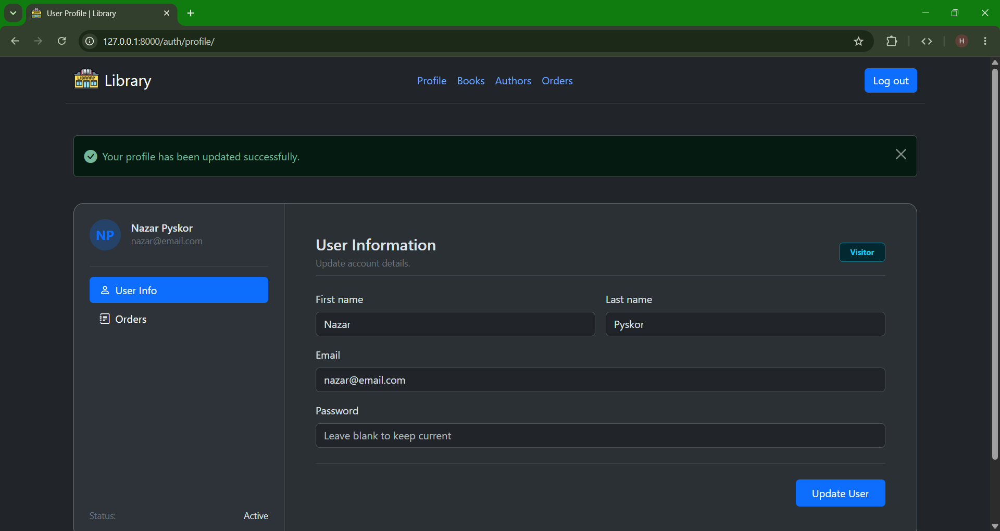
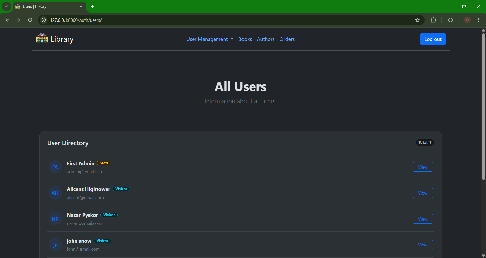
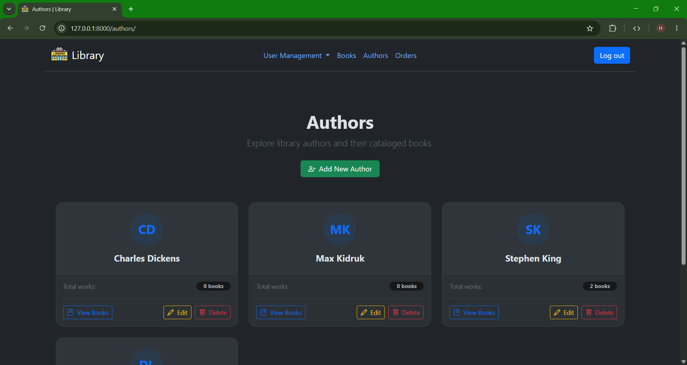
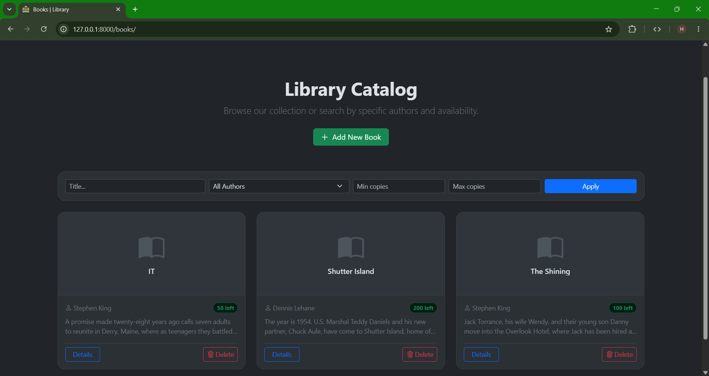
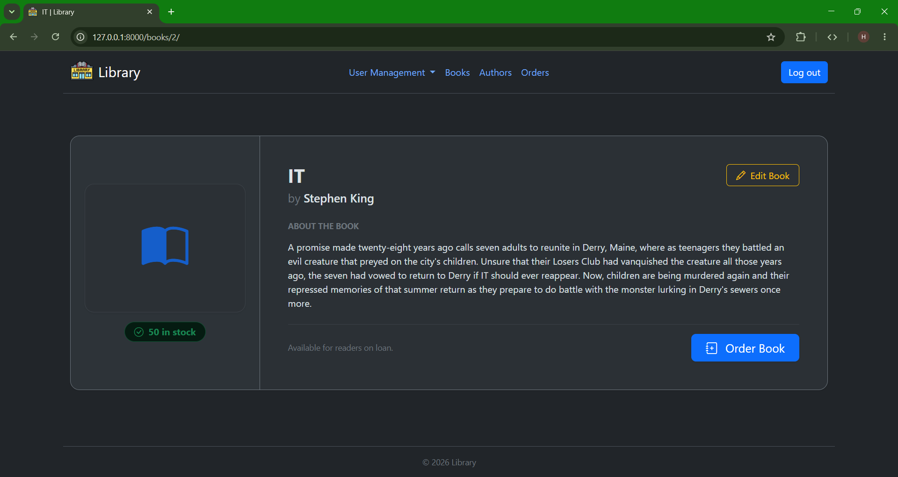
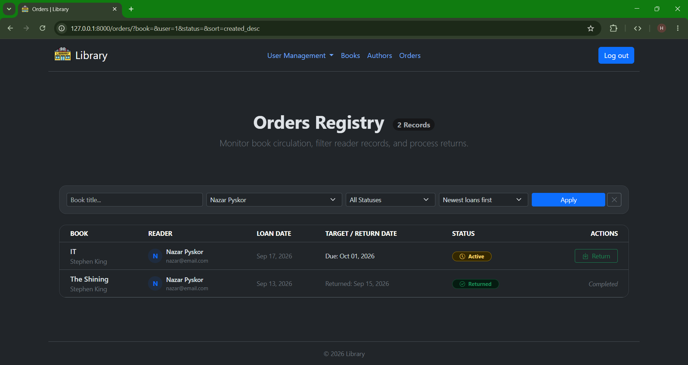

# 📚 Library Management System

Web application built with **Django**, **Bootstrap 5**, and **Alpine.js** for managing a library's catalog, authors, and book borrowing workflows.

## 🛠️ Tech Stack

- **Backend**: Python, Django
- **Frontend**: Bootstrap 5, Bootstrap Icons, Alpine.js
- **Database**: PostgreSQL

---

## ✨ Features

### 🔐 Authentication & Accounts

- **Authentication Flows**: Secure user registration, login, and logout workflows.
- **Profile Management**: Profile viewing and updating with validation and instant feedback.
- **Role-Based Access Control**: Strict separation between regular readers and library staff members using custom permission mixins (StaffRequiredMixin).

<table>
  <tr>
    <td width="50%" align="center">
      
      <br>
      <sub><b>User Profile</b>: Information management with validation feedback</sub>
    </td>
    <td width="50%" align="center">
      
      <br>
      <sub><b>Staff Only</b>: Reader directory accessible only to library staff</sub>
    </td>
  </tr>
</table>

### ✍️ Author Management

- **Author Directory**: Responsive card-based grid displaying authors with generated initial-based avatars and metadata.
- **Cross-Catalog Filtering**: Direct deep links on author cards to immediately view and filter all books associated with the selected author.
- **Staff Operations**: Protected creation and update workflows with dynamic form layouts for library staff.

<p align="center">
  
  <br>
  <sub><b>Author Directory</b>: Initial-based avatars, dynamic book counters, and staff management controls</sub>
</p>

### 📚 Book Catalog

- **Interactive Catalog**: Responsive grid displaying book title, author relations, dynamic availability badges ("X left" vs "Out of stock") and description.
- **Advanced Multi-Field Filtering**: Integrated inline search by title, author selection, and numeric copy count range (count_min / count_max).
- **Detailed Book Profiles**: Detail view presenting full description, inventory status, and immediate borrowing action for readers.
- **Staff Operations**: Protected creation and update workflows with dynamic form layouts for library staff.

<table>
  <tr>
    <td width="50%" align="center">
      
      <br>
      <sub><b>Catalog & Filtering</b>: Card grid with availability badges and inline search</sub>
    </td>
    <td width="50%" align="center">
      
      <br>
      <sub><b>Book Details</b>: Metadata overview, stock verification, and borrow action</sub>
    </td>
  </tr>
</table>

### 📋 Orders & Borrowing

- **Automated Stock Inventory**: Borrowing workflow with automated stock decrement and server-side validation to prevent checkout of out-of-stock titles.
- **Role-Aware Order History**: Order listings restricting regular readers to their personal borrowing history while providing staff full visibility across all readers.
- **Order Lifecycle Management**: One-click return processing for library staff that automatically marks orders as closed and restores book inventory.

<p align="center">
  
  <br>
  <sub><b>Orders Management</b>: Orders tracking with real-time status badges and one-click return processing</sub>
</p>

### 🎨 UI & UX

- **Modular Template Architecture**: Shared base layouts (`list_base.html`, `form_base.html`) and reusable components (`filter_panel.html`).
- **Responsive Design**: Modern styling powered by Bootstrap 5 and Bootstrap Icons.
- **Double-Submit Prevention**: Button state handling and loading spinners with Alpine.js.
- **Flash Feedback**: Informative Django messages for all create, update, and borrowing actions.

---

## 🚀 Getting Started

Follow these steps to run the project locally.

### 1. Clone the repository

```bash
git clone https://github.com/frant1x/Library-Management.git
cd Library-Management
```

### 2. Set up a virtual environment

```bash
# Linux / macOS
python3 -m venv venv
source venv/bin/activate

# Windows
python -m venv venv
venv\Scripts\activate
```

### 3. Install dependencies

```bash
pip install -r requirements.txt
```

### 4. Environment Variables

Create a `.env` file.

Example:

```env
# Django settings
DEBUG=True
SECRET_KEY=django-insecure-+&!@#%$^&*()_+1234567890abcdefghijklmnopqrstuvwxyz
ALLOWED_HOSTS=*

# Database
DB_NAME=library_db
DB_USER=your_db_user
DB_PASSWORD=your_db_password
DB_HOST=localhost
DB_PORT=5432
```

### 5. Create the database

Create the database before running migrations:

```bash
psql -U postgres -c "CREATE DATABASE library_db;"
```

### 6. Apply database migrations

```bash
cd library
python manage.py migrate
```

### 7. Create a superuser (Staff access)

```bash
python manage.py createsuperuser
```

You can also log in to the Django admin panel at http://127.0.0.1:8000/admin/ to manage user accounts and create additional library staff members.

### 8. Run the development server

```bash
python manage.py runserver
```

Open your browser and navigate to http://127.0.0.1:8000/.
